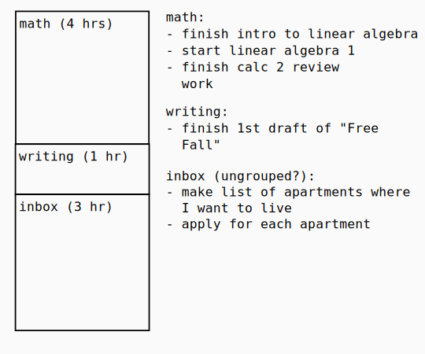

## Archive

# Perora personal life management framework

## What I need:
* Emotion management (reframing thoughts and logging experiences)
* Principle management (creating principles from reflections on experiences and determining if they're worth keeping)
* Belief management (creating beliefs and evaluating my faith in them and their value to me)
* Goal planning-work-review cycle management (something like OKR because of how it breaks things down and has a scoring system to evaluate progress)
* Work management (being able to quickly break down the current work load)
* Focus guard (allows me to keep my mind clear for the current task)
* Issue tracker (so that I don't tolerate personal problems and I have a way to work with them)
* Document management? (Secure management for markdown (or latex?) formatted documents, )

## What is it?
A to-do list? A scheduler? A time tracker? A notes app?

## Concepts (this will be messy for awhile while I clarify what I'm doing)

Some of my ideas seem to line up really well with David Allen's Getting Things Done.

#### Decisions

A decision session is a scheduled snippet of time where the object is to reach a conclusion about what action to take on something. Every session should have some writing about the decision, and can have linked principles or beliefs that help to form the decision.

#### [Swap space](./swap_space.md)

#### Context
Borrowed from Getting Things Done. Might either modify or clarify.

A context describes the condition required for a task to be done. This could be a:
* place (Buy eggs #store) (Could I do place scheduling? Actually, just assigning a context to a chunk of time would be enough to add tasks to it)
* person (Discuss business plan #tom) (Should I make a special syntax for this?)
* tool (Compile presentation #computer #home) (This is really murky; Wouldn't this example demand its own project? Does this idea of a context fit into my time chunks conception?)

## High level requirements

#### Server-Client API

REST or GraphQL API

#### Works on all of my stuff

Should be able to have major feature parity on all of my devices. The desktop interface should aim to share as many keyboard shortcuts as possible between platforms.

#### Transfers between all of my stuff, immediately

I should be able to start with one device and move to another device, picking up right where I left off. This is related to [Server-Client API](#Server-Client-API), because having an API means that sync is managed by the server.

#### Data portability

I should be able to get my data out of it and change it however I want.

The easiest way to do this might be to use a plain-text file format like JSON for a data store, but this might come at the cost of performance in the long run.

It might be better to use an external database but structure my data access abstraction such that I could swap out the backend with a JSON file with no compatibility issues. This way, I could easily export and import from JSON without having to deal with the possible performance issues. The downside of this is that I might need to work harder to come up with the right abstraction for the data layer.

## Nice-to-haves
### Runs on the cloud (deployable on either GCP or AWS, could look at services that handle this, like [Serverless](http://serverless.com))

It would be nice to be able to access my service from wherever I am.

There are challenges whether I do things this way or not:

* With
    * I have to build authentication to make sure that nobody besides me can access my private information
    * I have to make sure that nobody can
        * DoS me
        * Spike my cloud services bill (I think there's an option for capping spending at a dollar amount and just shutting services off after that point)
* Without
    * Offline storage and sync (which is a pain) has to be managed. Whatever I build has to be able to manage out-of-order edits to prevent my data from turning into garbage whenever one of my devices goes offline. An example of something that promises to do this is [Simperium](https://simperium.com/).

### Plugs into the apps I use

#### GitHub

I use GitHub's "project" feature as a to-do list when working on software projects. I could have bidirectional sync to a kind of "virtual" to-do list that I could manage with the same interface I use for my other tasks.

#### Anki

Although I need to flesh this use-case out (which means this probably isn't a super important feature to begin with), it would be really nice if I could add items that I want to commit to memory through my interface into Anki.

**I will kill this program if I try to make it too feature-heavy**, so this is likely something that I will have to consider later.