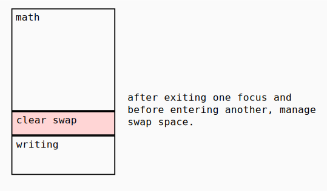

# Swap space

A list for anything that I can't deal with either in the current task or current context. (The definitions for those aren't very clear yet and I haven't worked through exactly how this works)

This list is not a "to-do" list. It's a collection of entries that should be dealt with (converted manually into something more actionable) as soon as possible. It helps with hyperfocus by allowing you to get out everything irrelevant to the current task.

__It should be empty before every context change.__ So if items are accumulated during one task, swap space should be managed before entering the next context.



```
17:03
thursday, march 15

context: math (2h 15m elapsed)

swap:

- 6 min: I'm not sure about X
- 2 min: I need to talk to Y about Z
- now: What does J mean?
```

### Advanced proposal

The swap space can be configured based on the requirements of the session. The freshness of new items is set at the beginning of the session. Some can be immediately marked as stale and automatically queued to be reviewed after the session is over, while some may be configured to become stale at a later date (like in the case of a "loose end" review in the evening, where each item will ask to be reviewed in the morning).

There should be a way to configure the freshness parameters of the selected swap item using the command options. Something like:

```
:ss . set freshness: ("stale" OR user date string (no recurrence))
```
Where '.' (or something similar) selects the currently editing swap item. I don't know about this particular syntax, but it's something to think about.

If there are any stale swap space items that aren't being taken care of, there should be a nasty warning on top of the out-of-session interface. Something like:

```
!!! 5 swap space items
```

#### Example GraphQL API:

```graphql
type SwapSpace {
    """
    A list of all swap space items
    """
    items(
        """
        Returns the elements in the list that come after the specified cursor.
        """
        after: String
        """
        Returns the elements in the list that come before the specified cursor.
        """
        before: String
        """
        Returns the first _n_ elements from the list.
        """
        first: Int
        """
        Returns the last _n_ elements from the list.
        """
        last: Int
    ): SwapItemConnection!
}

"""
The connection type for SwapItem.
"""
type SwapItemConnection {
    nodes: [SwapItem]
    edges: [SwapItemEdge]
    pageInfo: PageInfo!
    totalCount: Int!
}

"""
An edge in a connection.
"""
type SwapItemEdge {
    """
    A cursor for use in pagination.
    """
    cursor: String!
    """
    The item at the end of the edge.
    """
    node: SwapItem
}

"""
DOC
"""
type SwapItem implements Node {
    id: ID!
    # 
    contents: Document
}
```